<!-- 顶部波浪 banner：飘动 + 星星闪烁 来源: capsule-render -->

<!-- 打字机动效文字（自托管 SVG，不依赖第三方域名） -->

<!-- 终端风自我介绍（termstage 生成，纯 CSS 打字机动画 SVG，自托管） -->

<!-- 贡献统计卡片 来源: github-profile-summary-cards（原 github-readme-stats 公共实例 503 时顶替） -->

 
<!-- 提交热力图 来源: github-readme-activity-graph -->

 
<!-- 3D 贡献图（GitHub Action 自托管，每天更新） 来源: yoshi389111/github-profile-3d-contrib -->

 
<!-- 贪吃蛇吃贡献格（GitHub Action 自托管） 来源: Platane/snk -->

 
<!-- 编程语言占比 来源: github-profile-summary-cards -->

 
<!-- 技能图标 来源: go-skill-icons -->

<!-- 访问量计数器 来源: ghpvc -->

<!-- 底部波浪 banner -->

